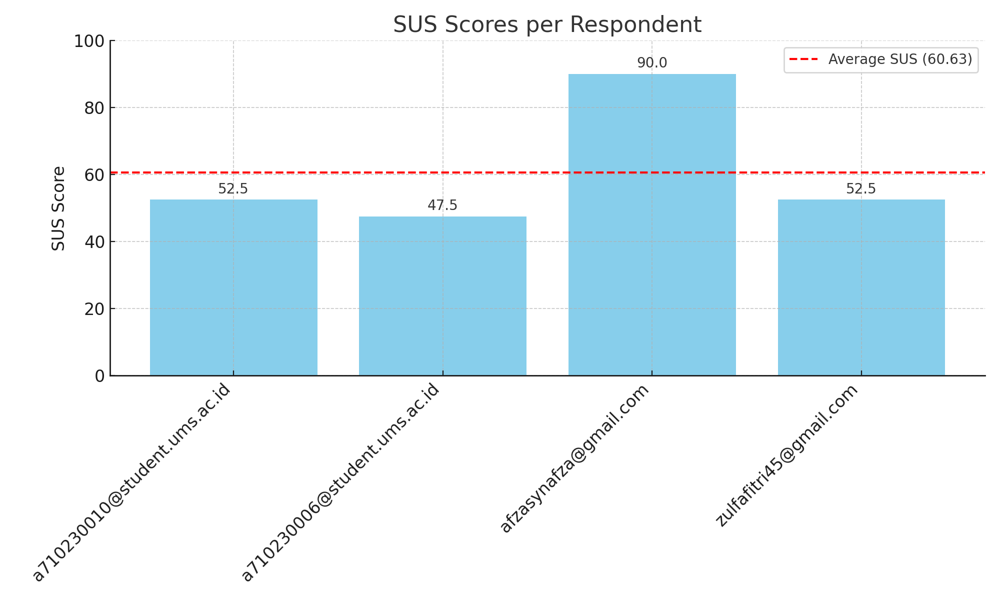

# Hasil Usability Study (SUS)

## Ringkasan Responden

| Email                           | SUS Score |
|--------------------------------|-----------|
| a710230010@student.ums.ac.id   | 52.5      |
| a710230006@student.ums.ac.id   | 47.5      |
| afzasynafza@gmail.com          | 90.0      |
| zulfafitri45@gmail.com         | 52.5      |

**Rata-rata SUS Score:** 60.63

## Interpretasi

Berdasarkan skala adjective standar:
- SUS >85 = Excellent
- SUS 70–85 = Good
- SUS 50–70 = Marginal
- SUS <50 = Poor

Secara keseluruhan, aplikasi ini berada pada tingkat **Marginal - Acceptable** dan dapat ditingkatkan lebih lanjut dalam aspek kegunaan.

## Grafik SUS Score

## Analisis Ringkas

Berdasarkan hasil survei dari 4 responden, didapatkan rata-rata skor SUS sebesar 60.63, yang termasuk dalam kategori Marginal – Acceptable. Artinya:

- Sistem dapat digunakan, namun masih memiliki sejumlah kendala usability yang dirasakan pengguna.
- Beberapa responden memberikan skor tinggi (seperti 90), namun ada juga yang memberikan skor lebih rendah di kisaran 47–52.5. Ini menunjukkan adanya persepsi berbeda terhadap kemudahan dan kenyamanan penggunaan sistem.
- Komentar atau jawaban responden pada item negatif (misalnya, "sistem terasa kompleks" atau "memerlukan bantuan teknis") menunjukkan adanya area yang bisa ditingkatkan, seperti:
  - Konsistensi antarmuka
  - Integrasi fungsi
  - Kemudahan bagi pengguna baru

### Kesimpulan

Aplikasi komunitas belajar kelompok peminatan prodi menunjukkan potensi yang baik, namun memerlukan perbaikan antarmuka dan alur penggunaan untuk memastikan semua pengguna dapat menggunakan sistem dengan mudah tanpa bantuan tambahan.

